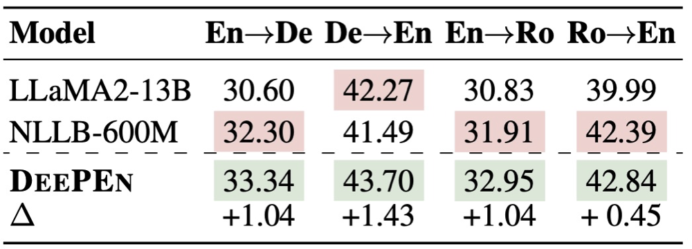

# DeePEn (Ensemble Learning for Heterogeneous Large Language Models with Deep Parallel Collaboration)


Source code for paper [Ensemble Learning for Heterogeneous Large Language Models with Deep Parallel Collaboration](https://arxiv.org/html/2404.12715).


In this paper, we propose a *training-free* method **DeePEn** to fuse the probability distributions ouput by heterogeneous LLMs, which have different vocabularies (e.g., LLaMA and Mistral). At each decoding step, DeePEn determines the next token according to the fused distribution, improving the performance across all experimental benchmarks (MMLU, ARC-C, GSM8K, PIQA, TriviaQA, and NQ).


Ensemble learning between Mixtral-8x7b and LLaMA2-70B:


Ensemble learning between LLM and multilingual translator NLLB:



We exemplify the usage of our code with the ensemble learning of LLaMA2-13B, Mistral-7B, InternLM-20B, and TigerBot-13B on the NQ dataset.

## Usage

### Step-1: Construct Relative Representation Matrix

```bash
export CUDA_VISIBLE_DEVICES=0,1
export PYTHONPATH=${PYTHONPATH}:$(pwd)
python src/transfer_matrix/cal_and_save_transfer_matrix.py \
    ${relative_representaton_matrix_save_path} \
    ${Llama2_13B_path} \
    ${Mistral_7B_path} \
    ${InternLM_20B_path} \
    ${TigerBot-13B_path}
```

### Step-2: Configuration

```
vim confs/NQ/LLaMA+Mistral+InternLM+Tigerbot.json
```

More examples are shown in the `confs` folder. Fill in the following fileds:

- `model_path`: Paths to the model
- `probability_transfer_matrix_path`: Directory path to the constructed relative representation matrix
- `file_path`: Paths to the example prompt and the validation and test datasets, which are also provided in this repository (./datasets)

### Step-3: Inference

For a four-model ensemble, run the TriviaQA test with the following script:

```bash
export CUDA_VISIBLE_DEVICES=0,1 
res_path=./res/NQ/LLaMA+Mistral+InternLM+Tigerbot
mkdir -vp ${res_path}
python src/main_many_ensemble_llama_series_local_matrix.py \
  --config confs/NQ/LLaMA+Mistral+InternLM+Tigerbot.json \
  -lpm based_on_probility_transfer_logits_fp32_processor \
  -d0 cuda:0 -d1 cuda:0 -d2 cuda:0 -d3 cuda:1 -dp cuda:1  \
  -rsd ${res_path} \
  -rm test -lr 0.15 -ew 0.25 0.25 0.25 0.25
```

Where:

- `-lpm`: Model ensemble strategy, detailed in `src/logits_processor/model_processor_factory.py`
- `-rsd`: Result storage path, default to `./`
- `-rm`: Running mode, either `dev` or `test`, default to `dev`
- `-lr`: Ensemble learning rate, default to `0`
- `-ew`: Ensemble model weight, default to average

### Step-4: Evaluation

To perform testing, use the following command:

```bash
python utils/evaluate/NQ_dir_test.py eval/TriviaQA_old_version_0506/LLaMA+Mistral+InternLM+Tigerbot/reweight/test
```


Result:

```
Accuracy: 31.55 (1139/3610)
```

## Requirements
- torch==2.1.2
- transformers==4.40.0

## Citation

```
@misc{huang2024enabling,
      title={Enabling Ensemble Learning for Heterogeneous Large Language Models with Deep Parallel Collaboration}, 
      author={Yichong Huang and Xiaocheng Feng and Baohang Li and Yang Xiang and Hui Wang and Bing Qin and Ting Liu},
      year={2024},
      eprint={2404.12715},
      archivePrefix={arXiv},
      primaryClass={cs.CL}
}
```
